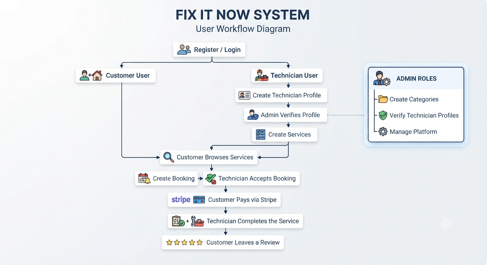

# 🛠️ Fix It Now Backend API

A RESTful backend API for a home service booking platform where customers can book services from verified technicians, complete secure Stripe payments, and leave reviews after service completion.

---

# 🚀 Features

- JWT Authentication (HTTP-only Cookies)
- Role Based Authorization (Admin, Technician, Customer)
- Technician Profile Verification
- Category Management
- Service Management
- Booking System
- Booking Availability Validation
- Stripe Checkout Integration
- Stripe Webhook Handling
- Payment History
- Review & Rating System
- Search, Filter, Pagination & Sorting
- Global Error Handling
- Zod Request Validation

---

# 🛠️ Tech Stack

- Node.js
- Express.js
- TypeScript
- PostgreSQL
- Prisma ORM
- JWT
- Zod
- Stripe
- Cookie Parser
- CORS

---
# 📦 Dependencies

## Production Dependencies

| Package | Purpose |
|---------|---------|
| `express` | Web framework for building the REST API |
| `@prisma/client` | Prisma ORM client for database operations |
| `@prisma/adapter-pg` | PostgreSQL adapter for Prisma |
| `pg` | PostgreSQL client for Node.js |
| `bcryptjs` | Password hashing |
| `jsonwebtoken` | JWT-based authentication |
| `cookie-parser` | Parse HTTP cookies for authentication |
| `cors` | Enable Cross-Origin Resource Sharing |
| `dotenv` | Load environment variables from `.env` |
| `http-status` | HTTP status code constants |
| `stripe` | Stripe payment and checkout integration |
| `zod` | Request data validation and schema validation |
| `tsup` | TypeScript application bundling |

## Development Dependencies

| Package | Purpose |
|---------|---------|
| `typescript` | Type-safe JavaScript development |
| `tsx` | Run TypeScript files and watch for changes during development |
| `prisma` | Prisma CLI for database migrations and Prisma Client generation |
| `@types/node` | TypeScript type definitions for Node.js |
| `@types/express` | TypeScript type definitions for Express |
| `@types/cookie-parser` | TypeScript type definitions for Cookie Parser |
| `@types/cors` | TypeScript type definitions for CORS |
| `@types/jsonwebtoken` | TypeScript type definitions for JSON Web Token |
| `@types/pg` | TypeScript type definitions for PostgreSQL |

----

# 📁 Project Structure

```
src
│
├── config/
├── lib/
├── middleware/
├── modules/
│   ├── auth/
│   ├── admin/
│   ├── booking/
│   ├── category/
│   ├── payment/
│   ├── review/
│   ├── service/
│   ├── technician/
│   └── user/
│
├── utils/
├── app.ts
└── server.ts
```

PROJECT STRUCTURE 


---

# 📦 Installation

Clone the repository

```bash
git clone https://github.com/Newton2n/fix-it-now-backend
```

Go into the project

```bash
cd fix-it-now-backend
```

Install dependencies

```bash
npm install
```

---

# ⚙️ Environment Variables

Create a `.env` file in the project root.

```env
DATABASE_URL=

APP_URL=

BCRYPT_SALT_ROUNDS=

JWT_ACCESS_SECRET=
JWT_REFRESH_SECRET=

JWT_ACCESS_EXPIRES_IN=
JWT_REFRESH_EXPIRES_IN=

STRIPE_SECRET_KEY=
STRIPE_WEBHOOK_SECRET=
ADMIN_PASSWORD =
```

---

# 🗄️ Database Setup

Generate Prisma Client

```bash
npx prisma generate
```

Run Database Migrations

```bash
npx prisma migrate dev
```

(Optional)

Open Prisma Studio

```bash
npx prisma studio
```

---

# ▶️ Run the Project

Development

```bash
npm run dev
```

Production Build

```bash
npm run build
```

Start Production Server

```bash
npm start
```

---

# 💳 Stripe Webhook

## Local Development

Start the Stripe CLI to forward webhook events to your local server.

```bash
npm run stripe:webhook
```

The command forwards events to:

```text
http://localhost:5000/api/payment/webhook
```

Copy the generated webhook signing secret and add it to your `.env` file.

```env
STRIPE_WEBHOOK_SECRET=whsec_xxxxxxxxxxxxxxxxx
```

---

## Production (Remote Webhook)

When deploying the application, configure a webhook endpoint in the Stripe Dashboard.

**Webhook URL**

```text
https://your-domain.vercel.app/api/payment/webhook
```

Select the required event(s):

- `checkout.session.completed`

After creating the webhook, copy the webhook signing secret and update the production environment variable:

```env
STRIPE_WEBHOOK_SECRET=whsec_xxxxxxxxxxxxxxxxx
```

> **Note:** Local and production webhooks use different signing secrets. Make sure the correct secret is configured for each environment.

# 📚 API Modules

| Module | Description |
|---------|-------------|
| Authentication | Register, Login & JWT Authentication |
| User | Update Profile & Password |
| Technician | Technician Profile & Availability |
| Category | Category Management |
| Service | Service CRUD |
| Booking | Booking Management |
| Payment | Stripe Checkout & Payments |
| Review | Review Management |
| Admin | User & Platform Management |

---

# 🔐 Authentication

The API uses **HTTP-only Cookie Authentication**.

After a successful login, the server sets an HTTP-only cookie that is automatically sent with every protected request.

---

# 📖 API Documentation

[View Postman API Documentation](https://documenter.getpostman.com/view/53393171/2sBY4LQ2Ci)


---

# 🚀 Deployment

Production

```
Vercel
```

Database

```
PostgreSQL
```

Payment Gateway

```
Stripe
```

# 🌐 Live API

[https://fix-it-now-xi.vercel.app](https://fix-it-now-xi.vercel.app)


---

# 📄 License

MIT
